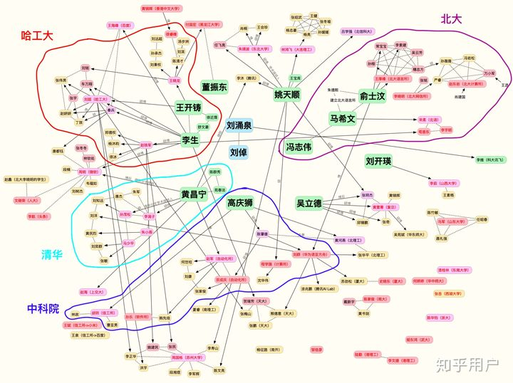

# :tada:NLP_resource :confetti_ball:
> [自然语言处理怎么最快入门？](https://www.zhihu.com/question/19895141) 
>
> 刘知远老师的 [NLP研究入门之道](https://github.com/zibuyu/research_tao) :+1::+1: :+1: 

### :balloon:Contents

| | |
| -- | -- |
| 论文列表 [:arrow_heading_down:](#mortar_board-论文列表) | 信息资讯 [:arrow_heading_down:](#loudspeaker-信息资讯) |
| 工具库 [:arrow_heading_down:](#cupid-工具库) | 数据集 [:arrow_heading_down:](#cyclone-数据集) |
| 主要研究机构 [:arrow_heading_down:](#fire-主要研究机构) | 基础知识/训练 [:arrow_heading_down:](#notebook-基础知识训练) |

## :mortar_board: 论文列表

> 顶会：[ACL](https://aclweb.org/)、[EMNLP](https://2021.emnlp.org/)、[NAACL](https://naacl.org/)、COLING （前三个会议的录用数是 CSRankings 在本领域的评价指标）
>
> 部分会议的[历年录用率](https://aclweb.org/aclwiki/Conference_acceptance_rates) 
>
> 自然语言处理的主要困难就是消除歧义，词法分析、句法分析、语义分析等过程都有所体现，为了解决消歧问题，我们需要借助语言学知识（如词法、句法、语义、上下文等）和世界知识（与语言无关）。
>
> - [自然语言处理-概述](https://nlpoverview.com/) 应用于自然语言深度学习的技术概述，包括理论，实现，应用和最先进的结果。 
> - [NLP 的巨人肩膀](https://zhuanlan.zhihu.com/p/50443871) ：较为详细的讲述了自然语言处理部分研究的发展历程 

### 列表

> 充分调研自己研究领域目前的发展状况，包括体系方法（是否有数学基础、方法步骤）、数据集（公认的训练和测试对象）、研究团队（关注其工作进展）。从实践出发，在阅读论文和代码实现上同时进步。

+ [NLP-journey](https://github.com/msgi/nlp-journey) 
+ [EventExtractionPapers](https://github.com/BaptisteBlouin/EventExtractionPapers) 

### 综述文章:boom:  

+ 预训练模型 Pre-trained Models for Natural Language Processing: A Survey. [`paper`](https://arxiv.org/pdf/2003.08271.pdf) 
+ 上下文嵌入 A Survey on Contextual Embeddings. [`paper`](https://arxiv.org/pdf/2003.07278.pdf)
+ 文本分类 Deep Learning Based Text Classification: A Comprehensive Review. [`paper`](https://arxiv.org/pdf/2004.03705.pdf) 
+ 命名实体识别 A Survey on Deep Learning for Named Entity Recognition. [`paper`](https://arxiv.org/pdf/1812.09449.pdf)
+ 对抗生成 A Review on Generative Adversarial Networks: Algorithms, Theory, and Applications. [`paper`](https://arxiv.org/pdf/2001.06937.pdf) 
+ 关系抽取 More Data, More Relations, More Context and More Openness: A Review and Outlook for Relation Extraction. [`paper`](https://arxiv.org/pdf/2004.03186.pdf) 
+ 知识图谱 A Survey on Knowledge Graphs: Representation, Acquisition and Applications. [`paper`](https://arxiv.org/pdf/2002.00388.pdf) 

### 文本表示

> 自然语言处理中面向具体场景的研究大部分都是按照 文本表示-编码更新-目标预测 的步骤展开，文本表示是最重要的环节。文本表示指的是将 word/sentence/document 等格式的输入文本用**低维紧致向量**来表示，即嵌入（embedding）。
>
> 以下只列出常用的模型算法，其他大量的论文和代码请从 [嵌入相关论文和代码](https://github.com/Separius/awesome-sentence-embedding) 中查阅，特别关注那些引用数超过 999+ 的论文。

统计语言模型 A Neural Probabilistic Language Model [`paper`](https://jmlr.org/papers/volume3/bengio03a/bengio03a.pdf) :+1::+1: :+1: 

|Date|Model Name|Paper|                            Codes                             |
|:---:|:---:|:---:|:---:|
|**浅层词嵌入**||||
|2013/01|[Word2Vec](https://code.google.com/archive/p/word2vec/ )|[Efficient Estimation of Word Representations in Vector Space](https://arxiv.org/abs/1301.3781)|[C](https://github.com/tmikolov/word2vec ) |
|2014|[Glove](https://nlp.stanford.edu/projects/glove/)|[GloVe: Global Vectors for Word Representation](https://nlp.stanford.edu/pubs/glove.pdf)|[C](https://github.com/stanfordnlp/GloVe ) |
|2014/05|Doc2Vec|[Distributed Representations of Sentences and Documents](https://arxiv.org/abs/1405.4053)|[Pytorch](https://github.com/inejc/paragraph-vectors )  [Python](https://github.com/jhlau/doc2vec ) |
|2016/07|[fastText](https://fasttext.cc/docs/en/english-vectors.html )|[Enriching Word Vectors with Subword Information](https://arxiv.org/abs/1607.04606)|[C++](https://github.com/facebookresearch/fastText ) |
|**上下文嵌入**|||（大多数的预训练模型可以通过transformers库进行加载）|
|2018|[GPT](https://github.com/openai/finetune-transformer-lm )|[Improving Language Understanding by Generative Pre-Training](https://s3-us-west-2.amazonaws.com/openai-assets/research-covers/language-unsupervised/language_understanding_paper.pdf)|[TF](https://github.com/openai/finetune-transformer-lm )  [Keras](https://github.com/Separius/BERT-keras )  [Pytorch, TF2.0](https://github.com/huggingface/transformers ) |
|-|GPT-2([117M](https://github.com/openai/gpt-2), [124M](https://github.com/openai/gpt-2), [345M](https://github.com/openai/gpt-2), [355M](https://github.com/openai/gpt-2), [774M](https://github.com/openai/gpt-2), [1558M](https://github.com/openai/gpt-2))|[Language Models are Unsupervised Multitask Learners](https://d4mucfpksywv.cloudfront.net/better-language-models/language-models.pdf)|[TF](https://github.com/openai/gpt-2 )  [Pytorch, TF2.0](https://github.com/huggingface/transformers )  [Keras](https://github.com/CyberZHG/keras-gpt-2 ) |
|2018/02|ELMO([AllenNLP](https://allennlp.org/elmo), [TF-Hub](https://tfhub.dev/google/elmo/2))|[Deep contextualized word representations](https://arxiv.org/abs/1802.05365)|[Pytorch](https://github.com/allenai/allennlp )  [TF](https://github.com/allenai/bilm-tf ) |
|2018/10|BERT([BERT](https://github.com/google-research/bert#pre-trained-models), [ERNIE](https://github.com/PaddlePaddle/ERNIE), [KoBERT](https://github.com/SKTBrain/KoBERT))|[BERT: Pre-training of Deep Bidirectional Transformers for Language Understanding](https://arxiv.org/abs/1810.04805)|[TF](https://github.com/google-research/bert )  [Keras](https://github.com/Separius/BERT-keras )  [Pytorch, TF2.0](https://github.com/huggingface/transformers )  [MXNet](https://github.com/imgarylai/bert-embedding )  [PaddlePaddle](https://github.com/PaddlePaddle/ERNIE )  [TF](https://github.com/hanxiao/bert-as-service/ )  [Keras](https://github.com/CyberZHG/keras-bert ) |
|2019/01|[Transformer-XL](https://github.com/kimiyoung/transformer-xl/tree/master/tf )|[Transformer-XL: Attentive Language Models Beyond a Fixed-Length Context](https://arxiv.org/abs/1901.02860)|[TF](https://github.com/kimiyoung/transformer-xl/tree/master/tf )  [Pytorch](https://github.com/kimiyoung/transformer-xl/tree/master/pytorch )  [Pytorch, TF2.0](https://github.com/huggingface/transformers ) |
|2019/05|ERNIE|[ERNIE: Enhanced Language Representation with Informative Entities](https://arxiv.org/abs/1905.07129)|[Pytorch](https://github.com/thunlp/ERNIE) |
|2019/07|[RoBERTa](https://github.com/pytorch/fairseq/blob/master/examples/roberta/README.md#pre-trained-models )|[RoBERTa: A Robustly Optimized BERT Pretraining Approach](https://arxiv.org/abs/1907.11692)|[Pytorch](https://github.com/pytorch/fairseq )  [Pytorch, TF2.0](https://github.com/huggingface/transformers ) |
|2019/09|ALBERT|[ALBERT: A Lite BERT for Self-supervised Learning of Language Representations](https://arxiv.org/abs/1909.11942)|[TF](https://github.com/brightmart/albert_zh) |
|2019/10|[DistilBERT](https://github.com/huggingface/transformers/tree/master/examples/distillation )|[DistilBERT, a distilled version of BERT: smaller, faster, cheaper and lighter](https://arxiv.org/abs/1910.01108)|[Pytorch, TF2.0](https://github.com/huggingface/transformers ) |
|    2019/10     | [T5](https://github.com/google-research/text-to-text-transfer-transformer#released-model-checkpoints) | [Exploring the Limits of Transfer Learning with a Unified Text-to-Text Transformer](https://arxiv.org/abs/1910.10683) |[TF](https://github.com/google-research/text-to-text-transfer-transformer) |
|    2020/05     |                             GPT3                             | [Language Models are Few-Shot Learners](https://arxiv.org/abs/2005.14165v2) |https://github.com/openai/gpt-3|

### 文本分类

+ TextCNN： Convolutional Neural Networks for Sentence Classification
+ TextRNN：
+ TextRCNN ：Recurrent Convolutional Neural Network for Text Classification
+ HAN ：Hierarchical Attention Networks for Document Classification

+ 

[返回目录 :arrow_heading_up:](#balloon-contents) 

##  :cupid: 工具库

> 分词、词性标注、命名实体识别等功能的工具，主要为 Python、Java 语言

+  [NLTK](http://www.nltk.org/) - 自然语言工具包 :+1:

+ [spacy](https://spacy.io/) - 使用 Python 和 Cython 的高性能的自然语言处理库  :+1:

+ [gensim](https://radimrehurek.com/gensim/index.html) - 用于对纯文本进行无监督的语义建模的库，支持 word2vec 等算法 :+1:

+ [StanfordNLP](https://nlp.stanford.edu/software/index.shtml)  - 适用多语言的 NLP Library ，包含 Java 和 Python 语言 :+1:

+ [OpenNLP](https://opennlp.apache.org/) - 基于机器学习的自然语言处理的工具包，使用 Java 语言开发 :+1:

+ [TextBlob](http://textblob.readthedocs.org/) - 为专研常见的自然语言处理（NLP）任务提供一致的 API 

  

+ [Jieba 结巴分词](https://github.com/fxsjy/jieba) - 强大的Python 中文分词库 :+1:

+ [HanLP](https://github.com/hankcs/HanLP) - 面向生产环境的多语种自然语言处理工具包 

+ [SnowNLP](https://github.com/isnowfy/snownlp) - 中文自然语言处理 Python 包，没有用NLTK，所有的算法都是自己实现的

+ [FudanNLP](https://github.com/FudanNLP/fnlp) - 用于中文文本处理的 Java 函式库

+ [THULAC](https://github.com/thunlp/THULAC) - 包括中文分词、词性标注功能。

> 预训练模型相关

+ [transformers](https://github.com/huggingface/transformers)  - 强大的预训练模型加载训练库:+1: 
  + 注意： `transformers > 3.1.0` 的版本下，在 `from_pretrained` 函数调用中添加 `mirror` 选项，如 `AutoModel.from_pretrained('bert-base-uncased', mirror='tuna')` 可以加快模型的下载。
  + 加上 `cache_dir="XXX"` 手动设置缓存地址，如果不设置，默认下载在 `~/.cache/torch` 或者 `C:\Users\XXXX\.cache\torch`，每个文件都有一个json作为标记，告知对应文件的作用。
+ [Chinese-Word-Vectors](https://github.com/Embedding/Chinese-Word-Vectors) 
+ [Chinese-BERT-wwm](https://github.com/ymcui/Chinese-BERT-wwm)     Pre-Training with Whole Word Masking for Chinese BERT

> 深度学习架构

+ [Pytorch](https://pytorch.org/)
+ [Tensorflow](https://tensorflow.google.cn/)
+ [Paddle](https://github.com/PaddlePaddle/Paddle) 

> 其他

+ [Interactive Attention Visualization](https://github.com/SIDN-IAP/attnvis) - 交互式的注意力可视化
+ [TextGrapher](https://github.com/liuhuanyong/TextGrapher) - 输入一篇文档，形成对文章语义信息的图谱化展示。
+ [Scattertext](https://hub.fastgit.org/JasonKessler/scattertext)   在语料库中找到有区别的术语并在交互式HTML散点图中显示它们

[返回目录 :arrow_heading_up:](#balloon-contents) 

## :cyclone: 数据集

+ [nlp-datasets](https://github.com/niderhoff/nlp-datasets) - 很好的自然语言资料集集合
+ [The Big Bad NLP Database](https://datasets.quantumstat.com/) 
+ [CLUEDatasetSearch](https://github.com/CLUEbenchmark/CLUEDatasetSearch)

### Fakenews
> Fake News Detection on Social Media: A Data Mining Perspective

+ [fakenewschallenge](http://www.fakenewschallenge.org/)
+ [FakeNewsCorpus](https://github.com/several27/FakeNewsCorpus)
+ [Chinese_Rumor_Dataset](https://github.com/thunlp/Chinese_Rumor_Dataset)
+ [Weibo dataset and two Twitter datasets](https://github.com/chunyuanY/RumorDetection)
+ [虚假新闻检测数据集](https://blog.csdn.net/Totoro1745/article/details/84678858)

### Event
+ [Integrated Crisis Early Warning System (ICEWS) Dataverse](https://dataverse.harvard.edu/dataverse/icews)
+ [GDELT](https://www.gdeltproject.org/data.html#rawdatafiles)

[返回目录 :arrow_heading_up:](#balloon-contents) 

## :fire: 主要研究机构
> 如有信息不正确或缺失，欢迎批评指正并留言，列表将定期更新。
>
> PS：此处排名不分先后，排名请看 [CSRankings](http://csrankings.org/#/index?nlp&world)。
>
> 下图为[国内NLP传承图](https://www.zhihu.com/question/24366306)：

 国内NLP传承图 知乎用户提供 

|  名称  |  GitHub  | 备注 |
|--|--|--|
| 高校 |||
| [斯坦福大学自然语言处理研究组 Stanford NLP](http://nlp.stanford.edu/) | https://github.com/stanfordnlp| Stanford CoreNLP |
| [卡耐基梅隆大学语言技术中心](https://www.lti.cs.cmu.edu/) | | |
| [北京大学计算语言学研究所](https://icl.pku.edu.cn/) | 语言计算与机器学习组 https://github.com/lancopku | 计算语言学教育部重点实验室 |
| [清华大学自然语言处理与社会人文计算实验室](http://nlp.csai.tsinghua.edu.cn/) | https://github.com/thunlp | 孙茂松、[刘知远](https://www.zhihu.com/people/zibuyu9)团队 |
| [哈工大社会计算与信息检索研究中心 SCIR](http://ir.hit.edu.cn/) | https://hub.fastgit.org/HIT-SCIR | 刘挺团队 |
| [中科院计算所自然语言处理研究组](http://nlp.ict.ac.cn/ictnlp_website/) | https://github.com/ictnlp |      |
| [中国科学院软件研究所中文信息处理实验室](http://www.icip.org.cn/zh/homepage/) |      |      |
| [复旦大学自然语言处理实验室](https://nlp.fudan.edu.cn/) | https://github.com/FudanNLP ||
| [南京大学自然语言处理研究组](http://nlp.nju.edu.cn/homepage/) |      | 微信号 NJU-NLP |
| [香港科技大学人类语言技术中心](http://www.cse.ust.hk/~hltc/) |      |     |
| [爱丁堡大学自然语言处理小组(EdinburghNLP)](https://edinburghnlp.inf.ed.ac.uk/) | https://github.com/EdinburghNLP/ | |
| 企业 |||
| [腾讯人工智能实验室](https://ai.tencent.com/ailab/nlp/zh/index.html) |   | |
| [微软亚研自然语言计算组](https://www.microsoft.com/en-us/research/group/natural-language-computing/) |      |      |
| [百度自然语言处理](https://nlp.baidu.com/homepage/index) | https://github.com/baidu | 提供 [PaddlePaddle](https://github.com/PaddlePaddle) 架构 |
| [搜狗实验室](http://www.sogou.com/labs/) |      | 提供[预料资源](http://www.sogou.com/labs/resource/list_pingce.php) |
| [阿里巴巴达摩院语言技术实验室](https://damo.alibaba.com/labs/language-technology) |      |      |

[返回目录 :arrow_heading_up:](#balloon-contents) 

## :loudspeaker: 信息资讯
+ **机器学习算法与自然语言处理** 微信公众号和[知乎专栏](https://www.zhihu.com/column/qinlibo-ml) 
+ **机器之心** 微信公众号和知乎
+ 跟踪自然语言处理（NLP）的进度: https://nlpprogress.com/
+ [ruder的博客](https://ruder.io/ ) 
+ [52nlp](https://www.52nlp.cn/) 

[返回目录 :arrow_heading_up:](#balloon-contents) 

## :notebook: 基础知识/训练

### 课程学习/资料

> PS：建议在具体领域中了解机器学习和深度学习的概念和模型，根据需要回过头仔细学习重点知识。

+ 斯坦福大学-自然语言处理与深度学习-[CS224n](http://web.stanford.edu/class/cs224n/) :+1:  B站视频[`url`](https://www.bilibili.com/video/av46216519)
+ 斯坦福大学-自然语言理解-[CS224U](https://web.stanford.edu/class/cs224u) 
+ 斯坦福大学-机器学习-[CS229旧](https://see.stanford.edu/Course/CS229/)  [CS229-新](http://cs229.stanford.edu/) 
+ 马萨诸塞大学-高级自然语言处理-[CS 685](https://people.cs.umass.edu/~miyyer/cs685) 
+ 约翰霍普金斯大学-机器翻译-[EN 601.468/668](http://mt-class.org/jhu/syllabus.html) 
+ 麻省理工学院-深度学习-[6.S094， 6.S091， 6.S093](https://deeplearning.mit.edu/) 
+ 巴塞罗那 UPC-[语音和语言的深度学习](https://telecombcn-dl.github.io/2017-dlsl/) 
+ 麻省理工学院-线性代数-[18.06 SC](http://ocw.mit.edu/18-06SCF11) 
+ [2021年47个机器学习项目](https://data-flair.training/blogs/machine-learning-project-ideas/) 
+ [Deep Learning book](https://www.deeplearningbook.org/)  :book:
+ [用 Python 进行自然语言处理](https://www.nltk.org/book/) :book: 
+ code-of-learn-deep-learning-with-pytorch [`url`](https://github.com/L1aoXingyu/code-of-learn-deep-learning-with-pytorch) 
+ nlp_course https://github.com/yandexdataschool/nlp_course
+ Deep Learning for NLP resources（[DL4NLP]( https://github.com/andrewt3000/dl4nlp)）

### 基础模型/方法

+ 长短期记忆网络 LSTM(Long Short-term Memory). [`paper`](http://www.bioinf.jku.at/publications/older/2604.pdf) 
+ 残差网络 Residual Network(Deep Residual Learning for Image Recognition). [`paper`](https://arxiv.org/pdf/1512.03385.pdf) 
+ DenseNet：Densely Connected Convolutional Networks [`paper`](https://arxiv.org/abs/1608.06993v5) 
+ Dropout(Improving neural networks by preventing co-adaptation of feature detectors). [`paper`](https://arxiv.org/pdf/1207.0580.pdf)
+ Batch Normalization: Accelerating Deep Network Training by Reducing Internal Covariate Shift. [`paper`](https://arxiv.org/pdf/1502.03167.pdf) 
+ 优化算法综述：An overview of gradient descent optimization algorithms [`paper`](https://arxiv.org/abs/1609.04747.pdf) 
+ Xiver 初始化： Understanding the Difficult of Training Deep Feedforward Neural Networks [`paper`](http://proceedings.mlr.press/v9/glorot10a/glorot10a.pdf) 
+ NLP 中激活函数的比较 Comparing Deep Learning Activation Functions Across NLP tasks  [`paper`](https://www.aclweb.org/anthology/D18-1472.pdf) 
+ 注意力机制 Attention is all you need  [`paper`]( https://papers.nips.cc/paper/7181-attention-is-all-you-need.pdf) 

### 博客

+ 详解 transformer： [The Illustrated Transformer](https://jalammar.github.io/illustrated-transformer/)  [中文翻译版](https://zhuanlan.zhihu.com/p/54356280) ，[Transformers from scratch](http://peterbloem.nl/blog/transformers) 
+ 放弃幻想，全面拥抱Transformer：自然语言处理三大特征抽取器（CNN/RNN/TF）比较 [`url`](https://zhuanlan.zhihu.com/p/54743941)
  + RNN 可以接纳不定长输入的由前向后进行信息线性传导，包含了位置信息编码
  + CNN 捕获到的是单词的 k-gram 片段信息，其中 k 表示滑动窗口大小
+ RNN vs LSTM vs GRU -- 该选哪个？[`url`](https://zhuanlan.zhihu.com/p/55386469) 
+ 难以置信！LSTM和GRU的解析从未如此清晰（动图+视频）。[`url`](https://blog.csdn.net/dqcfkyqdxym3f8rb0/article/details/82922386) 

### 其他

> 评价榜单 Evaluation :1st_place_medal: 

+ [GLUE](https://gluebenchmark.com/leaderboard) : [GLUE: A Multi-Task Benchmark and Analysis Platform for Natural Language Understanding](https://arxiv.org/abs/1804.07461) 
+ [SentEval](https://github.com/facebookresearch/SentEval): [SentEval: An Evaluation Toolkit for Universal Sentence Representations](https://arxiv.org/abs/1803.05449) 

> 训练技巧
>
> Neural Networks: Tricks of the Trade :book:

+ [深度学习网络调参技巧](https://zhuanlan.zhihu.com/p/24720954) 超参数包括学习率、批量、正规化等。
+ 早停法 Early Stopping （泛化误差超过指定阈值，训练过程中泛化误差增加，泛化误差长时间不下降）
+ Weight Decay Parameter 
+ 正则化方法 Regularization 
+ 多任务学习 
+ 数据增广

[返回目录 :arrow_heading_up:](#balloon-contents) 

##  :white_large_square: ​ TODO

:white_check_mark: 

:white_large_square: 

## :page_with_curl: 参考

+ [emoji-list](https://github.com/caiyongji/emoji-list)
+ https://github.com/keon/awesome-nlp 
+ https://github.com/kmario23/deep-learning-drizzle 深度学习、强化学习、机器学习、计算机视觉和 NLP 相关讲座

+ GitHub-api：https://api.github.com/repos/{:owner}/{:repository} 自动化查询相关项目

## :pray: 贡献 

如果您找到适合本项目的任何类别的资料，则请提出问题或发送 PR 。

感谢为此项目提供帮助的成员和参考的资料。:gift_heart:

